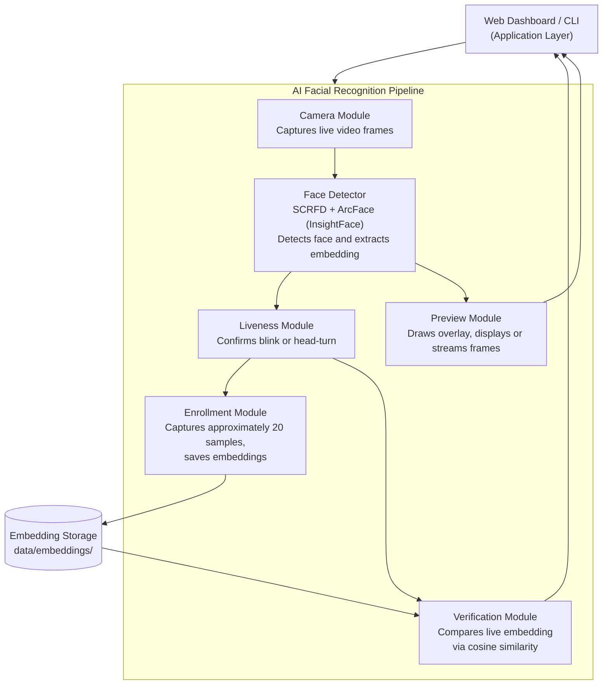

# Digital Estate Assets Discovery — Facial Biometric Verification Prototype


## Overview

This project is a proof-of-concept facial biometric enrollment and verification system, built as the identity-verification layer for a Digital Estate Assets Discovery application. It allows a beneficiary to be enrolled with their face and later verified against that enrollment, using face detection, face recognition, and a basic liveness check. The system is available both as a command-line application and as a local web application built on Flask.

## Purpose and Objective

The primary objective of this project was educational: to understand, from the ground up, how a practical facial recognition pipeline is designed and assembled — from face detection and embedding extraction, through liveness verification, to identity matching — and then to package that pipeline into something that behaves like a real product, complete with a web interface, live camera streaming, and a proper consent workflow.

The project deliberately avoids training any custom model. Instead, it is built entirely on an established, open-source face recognition framework (InsightFace), so that the engineering effort is focused on understanding how such a framework is correctly integrated, orchestrated, and exposed through an application — which is a more representative reflection of how facial recognition is actually deployed in real systems.

This is a prototype. It is not a finished product, and it has not been hardened for production use. Its purpose is to demonstrate and explain a working pipeline, not to serve as a deployable identity verification service.

## System Architecture

The system is organized into three layers that build on top of one another:

1. **AI Pipeline Layer** — camera capture, face detection, embedding extraction, liveness verification, and identity matching. This layer has no knowledge of whether it is being driven by a command-line script or a web browser.
2. **Application Layer** — two interchangeable front ends built on top of the AI pipeline: a command-line interface (`main.py`) and a Flask web server (`app.py`).
3. **Presentation Layer** — how the live camera feed and status information are displayed, either as a native OpenCV window (command line) or streamed into a browser (web).

This separation is intentional. The AI pipeline modules (`camera.py`, `face_detector.py`, `liveness.py`, `enrollment.py`, `verification.py`) contain no Flask code, no HTML, and no web-specific logic whatsoever. The web layer only supplies a different way of displaying the same pipeline's output, using a small dependency-injection point (an optional `preview` argument) rather than modifying the pipeline itself.



## How the System Works

### Enrollment Workflow

1. The user opens the Register page, fills in the beneficiary's details, and enters a unique Beneficiary ID.
2. Before any camera activity begins, a consent notice is presented, explaining that facial biometric data is about to be captured and stored, and requiring the user to explicitly agree before continuing. This consent, along with a timestamp, is recorded alongside the beneficiary's metadata.
3. Once consent is given, the camera opens and a liveness check is performed: the user is asked to blink or turn their head, confirming that a live person, not a static photograph, is in front of the camera.
4. After liveness is confirmed, the system captures approximately twenty samples of the beneficiary's face across slightly different poses and expressions. For each sample, the face is detected and a numerical embedding — a 512-dimensional vector that mathematically represents that face — is generated and saved to disk.
5. Once all samples are collected, an enrollment-complete confirmation is shown, and the beneficiary's embeddings are now available for future verification.

### Verification Workflow

1. The user opens the Verify page and enters the Beneficiary ID to be checked.
2. The system loads that beneficiary's previously stored embeddings from disk.
3. The camera opens, and the same liveness check used during enrollment is performed again.
4. Once liveness is confirmed, a single live face is captured and its embedding is generated.
5. This live embedding is compared, using cosine similarity, against every embedding stored for that beneficiary during enrollment. The highest similarity score found is used as the final match score, since comparing against several stored poses is more robust than comparing against only one.
6. If that score meets or exceeds a configured threshold, the result is VERIFIED; otherwise, it is NOT VERIFIED. The similarity score and the outcome are displayed to the user.

### Real-Time Camera Preview

Because face detection and face recognition are computationally expensive, running them on every single camera frame would make the live video preview appear slow and stuttering. To avoid this, the camera capture is decoupled from the recognition pipeline: a dedicated background thread continuously reads frames from the camera at its natural frame rate, independent of how quickly the recognition models are able to process them. The video preview therefore always plays smoothly, while the bounding box, landmarks, and status text overlaid on it update at whatever pace the recognition pipeline can actually achieve. This mirrors how real commercial face-recognition interfaces behave: the camera feed itself is never held hostage by the speed of the underlying model.

## Module Reference

### `config.py`
The single source of truth for every tunable value in the system: file storage paths, InsightFace model settings, detection confidence thresholds, the verification similarity threshold, liveness sensitivity, camera resolution, and preview refresh rate. Centralizing these values here means no tunable constant is hardcoded anywhere else in the codebase.

### `modules/camera.py`
Defines `CameraModule`, a minimal wrapper around OpenCV's `VideoCapture`. It knows only how to open a webcam, read a frame, and release the device. It has no awareness of faces, embeddings, or the web layer, and is implemented as a context manager so the camera device is always released correctly, even if an error occurs mid-session.

### `modules/camera_stream.py`
Defines `BufferedCameraStream`, which wraps a `CameraModule` with a dedicated background thread that continuously reads frames from the physical device into a thread-safe buffer. This is what allows the live preview to run at full camera frame rate independently of how fast the AI models can process each frame, as described above. It exposes the same interface as `CameraModule`, so it is a drop-in replacement wherever a camera is used.

### `modules/face_detector.py`
Defines `FaceDetector`, the only module that communicates directly with InsightFace. It wraps InsightFace's `FaceAnalysis` application, which bundles SCRFD for face detection and ArcFace for generating the 512-dimensional face embedding used for recognition, along with a facial landmark model. Given a frame, it returns the detected face's bounding box, confidence score, keypoints, landmarks, and embedding. It also exposes a convenience method that enforces exactly one face being present in a frame, which both enrollment and verification depend on.

### `modules/liveness.py`
Defines `LivenessCheck`, which requires the user to blink or turn their head before enrollment or verification is allowed to proceed. Head-turn detection is based on tracking the horizontal displacement of the nose keypoint relative to the width of the detected face; blink detection, when facial landmarks are available, is based on the Eye Aspect Ratio, a standard technique that measures the ratio of eye height to eye width and detects the characteristic dip that occurs when an eye closes. This module is intentionally isolated behind a single method, so that it can later be replaced with a more advanced anti-spoofing model without requiring any change to enrollment or verification. It should be understood as a basic anti-spoofing heuristic, not a robust defense against sophisticated spoofing attempts such as video replay.

### `modules/enrollment.py`
Defines `FaceEnrollment`, which orchestrates the camera, face detector, and liveness check to capture and store a new beneficiary's face samples. Samples are deliberately spaced out over time, rather than captured in immediate succession, so that the resulting set of embeddings reflects some natural variation in pose and expression, which in turn makes later verification more robust.

### `modules/verification.py`
Defines `FaceVerification`, which orchestrates the same components to capture a single live face and compare it against a beneficiary's previously stored embeddings, using cosine similarity, in order to reach a VERIFIED or NOT VERIFIED decision.

### `modules/preview.py`
Defines `PreviewRenderer`, responsible for all drawing logic used to visualize the pipeline's output: the bounding box, facial landmarks, and an information panel showing the current stage, progress, and status. When used from the command line, this class also owns a native OpenCV window.

### `modules/web_preview.py`
Defines `WebPreviewRenderer`, a subclass of `PreviewRenderer` used exclusively by the web application. It inherits all of the drawing logic unchanged, but replaces window management with JPEG encoding of each frame so it can be streamed to a browser, and includes the background refresh thread described above that keeps the video feed smooth and independent of inference speed.

### `modules/exceptions.py`
Defines the custom exception types used throughout the system — for example, when no face or multiple faces are detected, when the camera is unavailable, or when a liveness check times out — allowing calling code to distinguish between and respond appropriately to each failure condition.

### `main.py`
The command-line entry point. It exposes two commands, `enroll` and `verify`, each of which assembles the required modules and runs the corresponding workflow, displaying its output in a native window.

### `app.py`
The Flask web server. This file contains no detection, liveness, or matching logic of its own; its role is purely to expose the existing pipeline over HTTP. It serves the dashboard, registration, and verification pages; starts enrollment or verification as a background thread, since each of these workflows runs for several seconds and must not block the web server; streams the live annotated preview to the browser using MJPEG, a standard technique for pushing a continuous sequence of JPEG images to a web page; and exposes a small status-polling endpoint so the page can display the pipeline's current stage in real time. It also enforces that biometric consent has been explicitly given before an enrollment session is permitted to start.

### `templates/` and `static/`
The web interface itself: `templates/index.html` is the dashboard, `templates/register.html` is the enrollment page, including the consent notice presented before any camera activity begins, and `templates/verify.html` is the verification page, including the final result presented to the user. The accompanying CSS and JavaScript in `static/` handle styling and the browser-side logic that starts sessions, displays the live video stream, and polls for status updates.

### `data/embeddings/`
The storage location for enrolled biometric data. Each beneficiary has their own subfolder, named after their Beneficiary ID, containing their stored face embeddings as individual `.npy` files, along with a small `metadata.json` file recording their basic details and a record of the consent that was given at enrollment time.

## Technology Stack

- Python 3.12+
- OpenCV, for camera access and image handling
- InsightFace (SCRFD for detection, ArcFace for recognition), for the core face recognition models
- ONNX Runtime, the inference engine InsightFace's models run on
- NumPy, for embedding storage and numerical operations
- Flask, for the web application layer
- HTML, CSS, and vanilla JavaScript for the browser interface

## Project Structure

```
facial_biometric_poc/
├── app.py
├── main.py
├── config.py
├── requirements.txt
├── demo.png
├── modules/
│   ├── camera.py
│   ├── camera_stream.py
│   ├── face_detector.py
│   ├── liveness.py
│   ├── enrollment.py
│   ├── verification.py
│   ├── preview.py
│   ├── web_preview.py
│   └── exceptions.py
├── templates/
│   ├── index.html
│   ├── register.html
│   └── verify.html
├── static/
│   ├── css/
│   │   └── style.css
│   └── js/
│       ├── register.js
│       └── verify.js
└── data/
    └── embeddings/
```

## Setup and Installation

```bash
python3.11 -m venv venv
source venv/bin/activate        # Windows: venv\Scripts\activate

pip install -r requirements.txt
```

The first run downloads InsightFace's `buffalo_l` model pack, which bundles the SCRFD detector, the ArcFace recognition model, and a facial landmark model, automatically to a local cache directory.

## Usage

### Command Line

```bash
python main.py enroll <beneficiary_id>
python main.py verify <beneficiary_id>
```

Each command opens a native window showing the live camera feed with the same overlay used in the web version.

### Web Application

```bash
python app.py
```

Then open `http://127.0.0.1:5000` in a browser on the same machine, since the camera is accessed by the server itself rather than by the browser.

## Scope and Limitations

This system is a proof-of-concept and should be understood accordingly:

- It has no authentication, no encryption in transit, and no database; enrolled data is stored as plain files on the local disk.
- It is designed for a single active session at a time, since only one process can access the physical webcam at once.
- The liveness check is a basic heuristic and should not be relied upon as a defense against determined spoofing attempts.
- Session state in the web application is kept in memory and is lost if the server restarts.

These limitations were accepted deliberately, since the purpose of the project was to focus effort on the recognition pipeline itself, rather than on the surrounding infrastructure a production deployment would require.

## Acknowledgments and Disclosure

Face detection and face recognition in this project are performed entirely using the InsightFace open-source framework, specifically its SCRFD detection model and ArcFace recognition model. No custom face recognition model was trained or claimed as original work. Full credit for these models belongs to their authors and the InsightFace project: https://github.com/deepinsight/insightface

Claude AI (Anthropic) was used to assist in writing and structuring portions of the code, documentation, and integration logic in this repository.

This project was built strictly for educational purposes, to understand how a facial recognition pipeline can be designed, integrated, and deployed. It is not intended for production use, commercial deployment, or any application involving real personal or biometric data belonging to others. Anyone who chooses to adapt, extend, or deploy this project for a purpose beyond personal learning does so entirely on their own responsibility, and is expected to independently ensure compliance with all applicable data protection, privacy, and biometric information laws in their jurisdiction.
